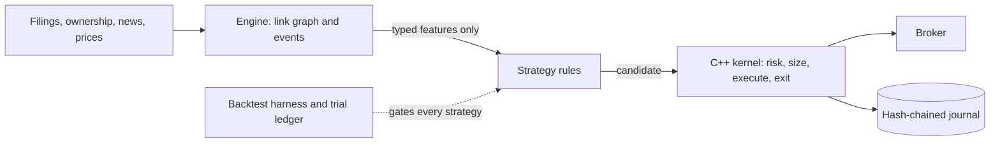

<div align="center">

# MiroHedge

**An AI-assisted systematic fund that trades the slow spread of news between linked firms.**


</div>

News about one company reaches its suppliers, customers, peers and
co-owned firms late, and slow filing and insider information is priced late.
One strategy, the Connected Drift Book, combines link propagation, filing text
change and opportunistic insider buys; deterministic code sizes, risks,
executes and exits the trades. Speed is not the edge; connecting the dots is.

Paper only, no real money. **No strategy has passed a gate yet.** Most will
not, and the system is built to find that out cheaply.

## How it works



- **Models read, code decides.** A model never sizes, orders, vetoes or touches
  an exit. Its output is a typed feature that an independent verifier and exact
  text-span checks must pass first.
- **HOLD is the default.** Stale data, a broken rule, an unapproved strategy or
  conflicting evidence all give HOLD. Absent data is never neutral data.
- **No promotion by code.** Demotion is automatic; promotion is a person, in
  chat, with evidence.

## What counts as proof

Every backtest is registered in a hash-chained trial ledger before it runs. A
strategy passes only with net-of-cost, search-adjusted evidence: bootstrap
confidence bounds, deflated Sharpe, overfitting probability, a 2x cost test and
positive alpha against a passive reference book. A model component must beat the
same strategy without it. A short paper run proves plumbing, not alpha.

## Status

| Area | State |
|---|---|
| C++ kernel, order router, journal, Alpaca paper transport | built and tested; parked |
| Backtest harness, trial ledger, cost model, statistics | built; shorts and margin ledger next |
| Collector, research graph, five data adapters | built |
| Link graph, three strategy components, composite | built on fixtures |
| Event pipeline, ripple reasoning | parked |
| Strategy: Connected Drift Book | pre-registration not yet approved, no backtest |

The ordered work list is [`TODO.md`](./TODO.md); the plan is
[`plan/`](./plan/README.md).

## Quick start

```bash
cp .env.example .env                                   # fill in locally; keys never go in git
python3 -m pip install -r research/requirements.txt    # Python 3.11+
bash scripts/check-manifest.sh                         # CHECK-MANIFEST: PASS
cd kernel && WITH_CURL=1 bash build.sh                 # full C++ gate, as a non-root user
python3 research/tests/test_stats.py                   # each test file runs standalone
```

The paper loop (Ubuntu 24.04 in WSL) is a plumbing test of the order path; see
[`ops/deploy/README.md`](./ops/deploy/README.md).

## Layout

```
plan/        the spec and source of truth
kernel/      C++ core: risk veto, sizing, router, runner, journal, broker transport
research/    engine, backtest harness, data adapters, trial ledger, preregistrations
collector/   Python signal collection
ops/         paper run tooling, forward ledgers, monitor, alerts
scripts/     manifest check, secret scan, stage sign-off
```

Read [`AGENTS.md`](./AGENTS.md) before contributing, then
[`ARCHITECTURE.md`](./ARCHITECTURE.md).

## Limits

- Paper fills flatter live results: no queue, no dividends, no impact.
- Exits do not yet cancel a resting stop first, so there is no automated
  month-end exit (the stop-before-close item in `TODO.md`).
- Data is free-tier: SIP bars delayed 15 minutes, EDGAR, GDELT. Paid data comes
  only on a measured trigger.
- Secrets never go in the repo, a log or a chat. Only `scripts/sign-stage.sh`
  writes the `STAGE` file.
- No license chosen yet; all rights reserved by the repository owner.
